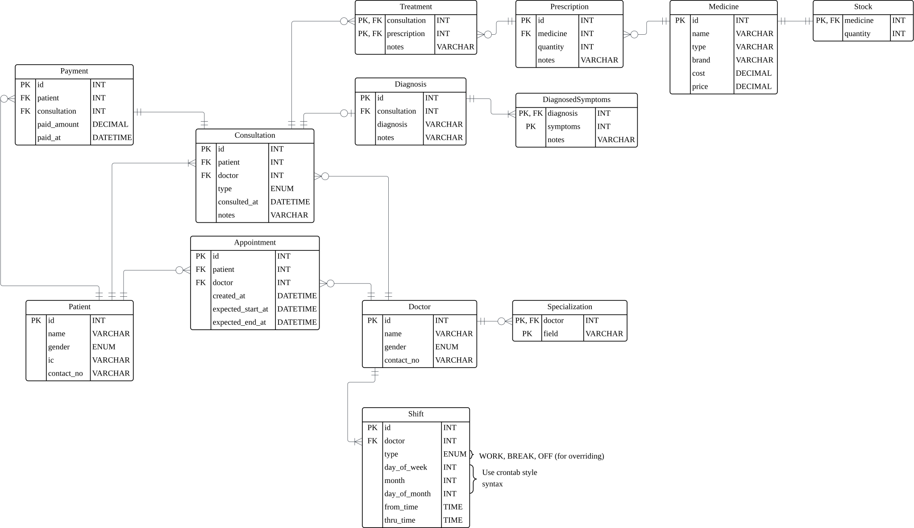

Project Overview
================

| [Project Description](#project-description) | [Requirements & Modules](#requirements--modules) | [Domain](#domain) |
|---------------------------------------------|--------------------------------------------------|-------------------|

## Project Description

This system is created for an on-campus clinic, with the main goal of providing medical
care for students in an orderly fashion.

Patients can walk in to request for a consultation on the spot, or book a later
appointment for a more qualified doctor.

## Requirements & Modules

> All module **MUST** include a reporting feature

All modules are mandatory otherwise specified.

### Patient Management Modules

- manage patient registration
- record maintenance
- manage walk-in queue

### Doctor Management Module

- manage doctor information
- manage duty schedule
- track doctor availability

### Consultation Management Module

- manage patient consultations
- arrange subsequent visit appointments

### Medical Treatment Management Module

- manage patient diagnosis
- maintain treatment history records

### Pharmacy Management Module

- manage medicine dispensing
- maintain medicine stock control

## Domain

### Entity Relationship Diagram

